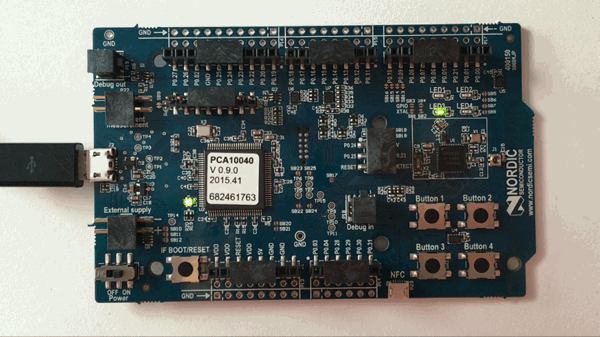

# hello world

> "hello world" on-board blinky LED examples of various dev boards. Firmware is flashed from a MAC OSX.

## nRF52 by Nordic

:star: [nRF52 dev board](https://www.nordicsemi.com/eng/Products/Bluetooth-low-energy/nRF52-DK) :star:

1. Download [GNU ARM Embedded Toolchain](https://launchpad.net/gcc-arm-embedded) and copy to `/usr/local`
- Download [J-Link](https://www.segger.com/downloads/jlink)
- Download SDK [nRF51_SDK_v6.x.x](http://developer.nordicsemi.com/nRF5_SDK/), uncompress it and `cd` inside
- Edit file `nrf51822/Source/templates/gcc/Makefile.posix` in the SDK

  ```sh
  ...
  GNU_INSTALL_ROOT := /usr/local/{NAME_OF_SDK_FOLDER}
  ...
  ```
- View the blinky code at `nrf51822/Board/pca10001/blinky_example/main.c`
- Go to the blinky `gcc` directory with `cd nrf51822/Board/pca10001/blinky_example/gcc`
- View the `Makefile`
- Compile it with `make -f Makefile all`
- Go to the newly created `_build` directory with `cd _build`
- Notice the created files `blinky_gcc_xxaa.bin` and `blinky_gcc_xxaa.hex`
- Connect the nRF52 board to your laptop via the USB cable
- Flash the blinky firmware with `JLinkExe -device nrf52 -if swd -speed 4000`
- Type the following to load the program with JLink:

  ```sh
  J-Link>? # read the help for commands r and g
  ...
  J-Link>connect
  ...
  J-Link>loadbin blinky_gcc_xxaa.bin 0
  ...
  J-Link>loadbin blinky_gcc_xxaa.hex 0x16000
  ...
  J-Link>r
  ...
  J-Link>g
  J-Link>exit
  ```
- View the on-board blinky LEDs

  

#### Reference

- [Getting started with nRF51 development on Mac OS X](https://devzone.nordicsemi.com/blogs/22/getting-started-with-nrf51-development-on-mac-os-x)
- [Flashing to nRF52](https://devzone.nordicsemi.com/question/65980/flashing-to-nrf52/)
