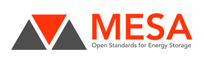

# Organizations

Alliances and standard bodies

| Organization | Description | Category |
| --- | --- |
| AIOTI
| AllSeen Alliance
| Bluetooth Special Interest Group
| Continua
| DASH7 Alliance
| HealthKit
| HomePLUG
| Home Kit
| Hyper/CAT
| IEC
| IEEE |
| IETF
| IOT eclipse
| IPSO Alliance
| ISA
| ISO
| LoRa Alliance
| [MESA](http://mesastandards.org/)    | accelerates interoperability, scalability, safety, quality, availability, and affordability in energy storage components and systems | Standards body
| Oasis
| OGC
| one M2M
| OPC Foundation
| Open automotive alliance
| [Open Charge Alliance](http://www.openchargealliance.org/)   | provide  powerful, open and interoperable communication protocols for the EV charging infrastructure
| Open Mobile Alliance
| Open Interconnect Consortium
| The connected lighting alliance
| Thread Group
| UPnP
| Weightless |
| W3C | | Standards body
| Wi-Fi Alliance
| Wireless Life Sciences Alliance
| WiSUN Alliance
| Zigbee Alliance
| Z-Wave Alliance
